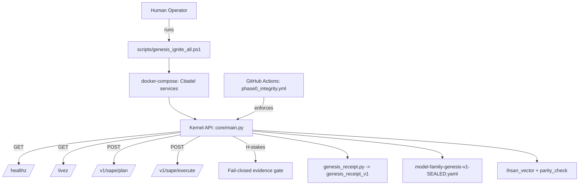

# BIZRA Trusted System Map (v1.0.1-genesis-citadel baseline)

This document is a **truth-stamped** system map intended to stay audit-grade.

## Truth labels
- **VERIFIED**: present in the sealable baseline (tag/commit) and referenced by a reproducible path.
- **PARTIAL**: present as anchors (genesis docs/config), but runtime mechanics are not yet active.
- **PLANNED**: design intent only; do not treat as deployed.
- **CONFLICT**: contradicts the baseline or creates governance/ethics risk unless reconciled.

---

## 1) Runtime Baseline (what must be treated as “real” today)

### 1.1 Canonical baseline artifacts (VERIFIED)
- **Tag**: `v1.0.1-genesis-citadel`
- **Citadel runtime**: `docker-compose.yml`
- **Kernel**: `core/main.py` (health + SAPE endpoints + fail-closed evidence gate)
- **SAPE runtime**: `core/sape.py`, `core/fate.py`, `core/wisdom.py`
- **Genesis receipts**: `scripts/genesis_receipt.py` + `schemas/genesis_receipt_v1.schema.json`
- **Model routing**: `model-family-genesis-v1-SEALED.yaml`
- **Ihsān parity**: `bizra_kernel/ihsan_vector.py` + `tools/ihsan_parity_check.py`
- **CI integrity**: `.github/workflows/phase0_integrity.yml`

### 1.2 Current baseline mermaid (VERIFIED map)

---

## 2) Atlas v2.0 Overlay (match / partial / planned)

### 2.1 L0 Network Foundation
- **Atlas**: libp2p / QUIC / Noise, discovery (mDNS/DHT), relay NAT traversal
- **Truth stamp**: PLANNED
- **Reason**: no evidence of live P2P fabric in the sealable baseline yet.

### 2.2 L1 Ledger & Consensus
- **Atlas**: BlockGraph DAG, PoI engine, SEED/BLOOM dual token, weighted PoI + stake consensus
- **Truth stamp**: PARTIAL
- **Reason**: genesis + tokenomics anchors exist; distributed consensus mechanics not yet attested.

### 2.3 L2 Intelligence & Agents (PAT/SAT)
- **Atlas**: MoE LLM, memory systems, policy engine, self-play arena, PAT teams, SAT-49
- **Truth stamp**: PARTIAL → PLANNED
- **Reason**: SAPE exists (operational); PAT/SAT orchestration needs activation wiring.

### 2.4 L3 Governance & Crown
- **Atlas**: progressive gates + “Crown proof chain” verification
- **Truth stamp**: PARTIAL
- **Reason**: CI gates exist; full governance voting + formal proof chain not yet executed end-to-end.

---

## 3) Minimal Activation Plan (PAT/SAT “alive” without pretending full decentralization)

### PAT (Personal Autonomy Team) — minimal viable activation
- Roles: Tank (safety), DPS (execution), Healer (memory), Support (RAG)
- Wiring: PAT calls `/v1/sape/plan` and `/v1/sape/execute` under the evidence gate.
- State: store session memory in Neo4j (or file-backed store if Neo4j is optional).
- Queue: use Redis as job queue/pubsub.

### SAT (System Autonomy Team) — minimal viable activation
- SAT runs as “review + enforcement” workers:
  - validates evidence receipts
  - runs ihsan parity + truth lint
  - blocks unsafe merges/releases
- This is the **local** version of the Governance/Crown pipeline.

---

## 4) What to update next (to keep the map trustworthy)
1. Create a `docs/truth_map.yaml` that enumerates every “box” with:
   - truth label, path(s), and hash
2. Auto-generate diagrams from `truth_map.yaml` (no manual diagrams).
3. Every release updates the truth map as part of CI.

