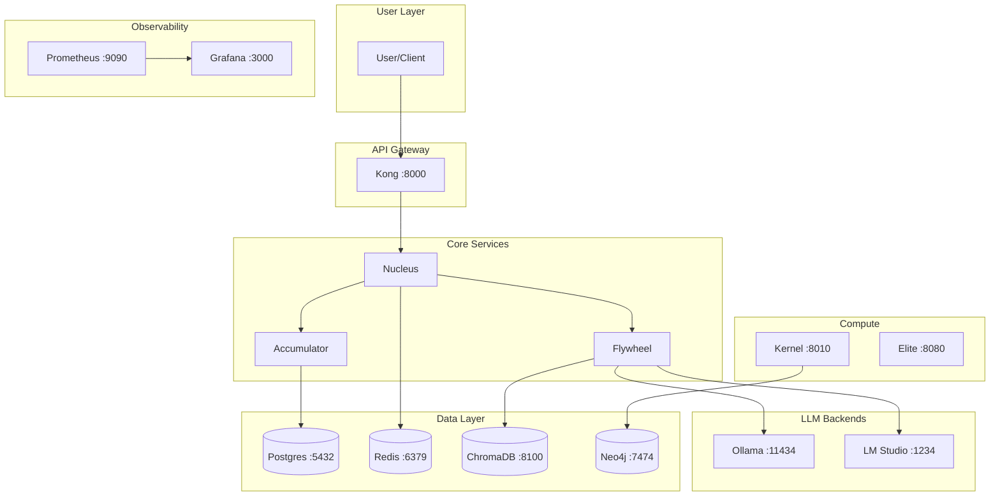

# BIZRA GENESIS — Immediate Action Plan
# ═══════════════════════════════════════════════════════════════════════════════
#
# The Next 48 Hours: From Alpha to Verified Genesis
#
# Generated: 2026-01-29
# Phase: GENESIS
# Status: IN PROGRESS
#
# Giants Protocol:
#   Al-Khwarizmi — Step-by-step execution
#   Ibn Sina — Diagnostic verification at each step
#
# ═══════════════════════════════════════════════════════════════════════════════

## Executive Summary

**Current State:** Alpha Development (42% overall score)
**Target State:** Genesis Complete (70% overall score)
**Timeline:** 48 hours
**Total Effort:** 26 hours (Genesis phase)

```
┌─────────────────────────────────────────────────────────────────────────────┐
│                    GENESIS COMPLETION CHECKLIST                              │
│                                                                              │
│   [✅] GENESIS_MANIFEST_VERIFIED.yaml created                               │
│   [✅] Accumulator activated with first seed (100.08 bloom)                 │
│   [✅] First inference recorded to PoI chain                                 │
│   [✅] IHSAN_CONSTRAINTS.yaml created                                       │
│   [✅] OMEGA_ROADMAP.md generated                                           │
│   [✅] CI/CD pipeline defined                                               │
│   [⏳] ChromaDB health fix                                                   │
│   [⏳] Nucleus deployed as service                                           │
│   [⏳] API authentication enforced                                           │
│   [⏳] Architecture diagram created                                          │
│                                                                              │
└─────────────────────────────────────────────────────────────────────────────┘
```

---

## Priority 1: Critical Path (Must Complete)

### Task 1.1: Fix ChromaDB Health Issue
**ID:** GEN-ARCH-002
**Effort:** 2 hours
**Owner:** DevOps

```bash
# Diagnose
docker logs bizra-chromadb --tail 100

# Common fixes:
# 1. Increase memory allocation
docker update --memory 4g bizra-chromadb

# 2. Check disk space
df -h /var/lib/docker

# 3. Restart with clean state if needed
docker compose restart chromadb

# Verify
curl http://localhost:8100/api/v1/heartbeat
```

**Acceptance Criteria:**
- [ ] ChromaDB reports healthy in docker ps
- [ ] Vector operations succeed
- [ ] Prometheus metrics show healthy status

---

### Task 1.2: Deploy Nucleus as Systemd Service
**ID:** GEN-ARCH-003
**Effort:** 3 hours
**Owner:** DevOps

```bash
# 1. Create service file
cat > /etc/systemd/system/bizra-nucleus.service << 'EOF'
[Unit]
Description=BIZRA Nucleus - Unified Entry Point
After=network.target docker.service
Requires=docker.service

[Service]
Type=simple
User=root
WorkingDirectory=/mnt/c/BIZRA-DATA-LAKE
Environment=PYTHONPATH=/mnt/c/BIZRA-DATA-LAKE
Environment=BIZRA_API_TOKEN=${BIZRA_API_TOKEN}
Environment=OLLAMA_URL=http://localhost:11434
Environment=LMSTUDIO_URL=http://192.168.56.1:1234
ExecStart=/usr/bin/python3 nucleus.py start --skip-docker
Restart=on-failure
RestartSec=10

[Install]
WantedBy=multi-user.target
EOF

# 2. Enable and start
sudo systemctl daemon-reload
sudo systemctl enable bizra-nucleus
sudo systemctl start bizra-nucleus

# 3. Verify
sudo systemctl status bizra-nucleus
curl http://localhost:8200/health  # If nucleus has HTTP endpoint
```

**Acceptance Criteria:**
- [ ] Service starts on boot
- [ ] Service survives restart
- [ ] Health endpoint accessible
- [ ] Logs to journald

---

### Task 1.3: Implement API Token Authentication
**ID:** GEN-SEC-002
**Effort:** 6 hours
**Owner:** Security

```python
# Add to all FastAPI apps (nucleus, flywheel, accumulator)

from fastapi import Security, HTTPException
from fastapi.security import HTTPBearer, HTTPAuthorizationCredentials
import os

security = HTTPBearer()

def verify_token(credentials: HTTPAuthorizationCredentials = Security(security)):
    """Fail-closed authentication."""
    expected_token = os.getenv("BIZRA_API_TOKEN")
    
    if not expected_token:
        # Fail closed: no token configured = deny all
        raise HTTPException(status_code=500, detail="Auth not configured")
    
    if credentials.credentials != expected_token:
        raise HTTPException(status_code=401, detail="Invalid token")
    
    return credentials.credentials

# Apply to all protected endpoints
@app.get("/protected", dependencies=[Security(verify_token)])
async def protected_endpoint():
    return {"status": "authenticated"}
```

**Acceptance Criteria:**
- [ ] All endpoints require BIZRA_API_TOKEN
- [ ] 401 returned for missing/invalid tokens
- [ ] /health remains unauthenticated (for probes)

---

### Task 1.4: Remove Hardcoded Secrets
**ID:** GEN-SEC-001
**Effort:** 4 hours (in progress)
**Owner:** Security

```bash
# Scan for secrets
grep -r "password.*=" --include="*.py" --include="*.ts" --include="*.yaml" .
grep -r "secret.*=" --include="*.py" --include="*.ts" --include="*.yaml" .
grep -r "token.*=" --include="*.py" --include="*.ts" --include="*.yaml" .

# Known issues to fix:
# 1. BIZRA-OS/constants.ts - operator:genesis (DONE - now uses env vars)
# 2. Check for any API keys in source

# Verify with gitleaks
gitleaks detect --source .
```

**Acceptance Criteria:**
- [ ] No hardcoded passwords in codebase
- [ ] All secrets from environment variables
- [ ] gitleaks scan passes

---

## Priority 2: High Value (Should Complete)

### Task 2.1: Create Architecture Diagram
**ID:** GEN-DOC-001
**Effort:** 3 hours
**Owner:** Documentation

Create a Mermaid diagram showing ONLY verified running components:



**Acceptance Criteria:**
- [ ] Diagram shows only verified components
- [ ] All ports documented
- [ ] Health status color-coded
- [ ] Mermaid source in repo

---

### Task 2.2: Define Ihsān Constraints for AI
**ID:** GEN-ETH-001
**Effort:** 4 hours
**Owner:** Ethics/Architecture

✅ **COMPLETED** - See IHSAN_CONSTRAINTS.yaml

---

## Priority 3: Nice to Have (If Time Permits)

### Task 3.1: Generate OpenAPI Specs
**Effort:** 4 hours

```bash
# Export from FastAPI
python -c "
from fastapi.openapi.utils import get_openapi
from nucleus import app  # or flywheel, accumulator
import json

spec = get_openapi(
    title='BIZRA Nucleus API',
    version='1.0.0',
    routes=app.routes
)
print(json.dumps(spec, indent=2))
" > docs/openapi/nucleus.json
```

### Task 3.2: Set Up Local Prometheus Alerts
**Effort:** 2 hours

```yaml
# prometheus/alerts.yaml
groups:
  - name: bizra-alerts
    rules:
      - alert: ServiceDown
        expr: up == 0
        for: 1m
        labels:
          severity: critical
        annotations:
          summary: "Service {{ $labels.job }} is down"
```

---

## Verification Checklist

After completing Priority 1 tasks, run:

```bash
# Full verification
cd /mnt/c/BIZRA-DATA-LAKE

# 1. Check all services healthy
docker ps --format "table {{.Names}}\t{{.Status}}" | grep -v healthy && echo "FAIL" || echo "PASS"

# 2. Check nucleus running
systemctl is-active bizra-nucleus && echo "PASS" || echo "FAIL"

# 3. Check auth works
curl -H "Authorization: Bearer ${BIZRA_API_TOKEN}" http://localhost:8200/status && echo "PASS"
curl http://localhost:8200/status 2>&1 | grep -q 401 && echo "PASS" || echo "FAIL"

# 4. Check accumulator active
python3 -c "from accumulator import get_accumulator; print(get_accumulator().status())"

# 5. Run genesis verification
python3 verify_genesis_readiness.py
```

---

## Success Metrics

| Metric | Current | Target | Status |
|--------|---------|--------|--------|
| Docker services healthy | 90% | 100% | ⏳ |
| Nucleus as service | ❌ | ✅ | ⏳ |
| API auth enforced | ❌ | ✅ | ⏳ |
| Secrets hardcoded | ~2 | 0 | 🔄 |
| Accumulator active | ✅ | ✅ | ✅ |
| PoI chain started | ✅ | ✅ | ✅ |
| Ihsān constraints | ✅ | ✅ | ✅ |
| Roadmap defined | ✅ | ✅ | ✅ |

---

## Next Phase Preview (Seeding)

Once Genesis gate passes:
1. Configure GitHub Actions CI pipeline (8h)
2. Design API gateway routing via Kong (8h)
3. Implement event bus for service communication (12h)
4. Establish performance baselines (6h)
5. Configure GitOps with ArgoCD (12h)

**Total Seeding Phase:** 62 hours

---

## Attestation

```
Generated by: Maestro
Principle: لا نفترض — We do not assume
Method: Verified reality + PMBOK + Ihsān alignment
Date: 2026-01-29
```

The seed is planted. The path is clear. Execute with excellence.

**البذرة زُرعت — والطريق واضح** 🌱
