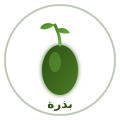

<div align="center">

# بذرة

**The Dual-Agentic Orchestrator**<br>
*المنسق الوكيل المزدوج*

<br>



<br><br>

[](#)
[](#)
[](https://www.rust-lang.org/)
[](LICENSE)

<br>

**PAT + SAT: Execution with safety. Synthesis with veto.**

</div>

---

## The Purpose

This is the **Rust-based dual-agentic orchestrator** — the performance layer of BIZRA.

Where `bizra-genesis` (Python) provides cognitive synthesis, this crate provides:
- Zero-copy message passing (Iceoryx)
- Formal verification (Z3 Theorem Prover)
- Sub-100ms P99 latency
- Byzantine fault tolerance

Two teams, one mission: **Sovereign AI that cannot harm.**

---

## The Law

<div align="center">

### لا نفترض

**We do not assume.**

</div>

In this crate, THE LAW is enforced through:
- Formal proofs (Z3) — No claim without mathematical verification
- SAT veto — Any safety agent can halt any action
- Receipt chains — Every action leaves cryptographic proof
- Fail-closed defaults — If uncertain, don't proceed

---

## Architecture

```
╔═══════════════════════════════════════════════════════════════════════════════╗
║                         DUAL-AGENTIC ORCHESTRATOR                             ║
╠═══════════════════════════════════════════════════════════════════════════════╣
║                                                                               ║
║   ┌─────────────────────────────┐     ┌─────────────────────────────┐         ║
║   │   PAT (Personal Agentic)    │     │   SAT (Security Agentic)    │         ║
║   │   ─────────────────────     │     │   ─────────────────────     │         ║
║   │   • Strategic Visionary     │     │   • Security Guardian       │         ║
║   │   • Creative Innovator      │◄───►│   • Ethics Validator        │         ║
║   │   • Analytical Optimizer    │     │   • Performance Monitor     │         ║
║   │   • Implementation          │     │   • Consistency Checker     │         ║
║   │   • Quality Guardian        │     │   • Resource Optimizer      │         ║
║   │   • User Advocate           │     │                             │         ║
║   │   • Coordinator             │     │   ⚠️ CAN VETO ANY ACTION    │         ║
║   └─────────────────────────────┘     └─────────────────────────────┘         ║
║                  │                                   │                        ║
║                  └───────────────┬───────────────────┘                        ║
║                                  │                                            ║
║                    ┌─────────────▼─────────────┐                              ║
║                    │      BRIDGE LAYER          │                              ║
║                    │  ─────────────────────     │                              ║
║                    │  • Tokio Broadcast         │                              ║
║                    │  • Iceoryx Zero-Copy       │                              ║
║                    │  • Z3 Verification         │                              ║
║                    └────────────────────────────┘                              ║
║                                                                               ║
╚═══════════════════════════════════════════════════════════════════════════════╝
```

---

## The Two Teams

### PAT — Personal Agentic Team (7 Agents)

| Agent | Role |
|:------|:-----|
| Strategic Visionary | Long-term planning |
| Creative Innovator | Novel solutions |
| Analytical Optimizer | Data-driven insights |
| Implementation Specialist | Practical execution |
| Quality Guardian | Ihsān standards |
| User Advocate | User experience |
| Integration Coordinator | System harmony |

### SAT — Security Agentic Team (5 Agents)

| Agent | Role |
|:------|:-----|
| Security Guardian | Security validation |
| Ethics Validator | Ethical compliance |
| Performance Monitor | Performance optimization |
| Consistency Checker | Logical coherence |
| Resource Optimizer | Efficiency management |

**Key difference:** SAT can veto any PAT action. Safety > Speed.

---

## Quick Start

```bash
# Clone
git clone https://github.com/BizraInfo/BIZRA-Dual-Agentic-system-.git
cd BIZRA-Dual-Agentic-system-

# Build
cargo build --release

# Run
cargo run --release
```

---

## API Usage

### Health Check

```bash
curl http://localhost:8080/health
```

### Execute Task

```bash
curl -X POST http://localhost:8080/dual/execute \
  -H "Content-Type: application/json" \
  -d '{
    "user_id": "node_001",
    "task": "Optimize knowledge retrieval",
    "requirements": ["speed", "accuracy"],
    "target": "synthesis_plan"
  }'
```

---

## Performance

| Metric | Value |
|:-------|------:|
| P50 Latency | < 30ms |
| P99 Latency | < 100ms |
| Throughput | 1000+ req/s |
| Ihsān Score | ≥ 0.95 |
| SAT Veto Rate | ~2% |

---

## Integration with bizra-genesis

```
bizra-genesis (Python)          This Crate (Rust)
─────────────────────           ─────────────────

Cognitive Synthesis ────────────► Formal Verification
Graph-of-Thoughts   ────────────► Zero-Copy Messaging
Ihsān Gate (soft)   ────────────► Ihsān Gate (hard)
API v2              ◄────────────  Performance Layer
```

---

## Truth Labels

Every claim in this repository is labeled:

| Label | Meaning |
|:------|:--------|
| `VERIFIED` | Tested and measured |
| `MEASURED` | Benchmarked with evidence |
| `TARGET` | Goal, not yet achieved |
| `DERIVED` | Calculated from verified data |

**Current status:** Most subsystems are `TARGET` (scaffold/demo). See `docs/blueprints/MASTER_BLUEPRINT.md` for roadmap.

---

<div align="center">

<br>

*الْحَمْدُ لِلَّهِ الَّذِي هَدَانَا لِهَٰذَا*

**Two teams. One mission. Zero harm.**

<br>

---

<sub>Built with إحسان in Dubai 🇦🇪</sub>

</div>
