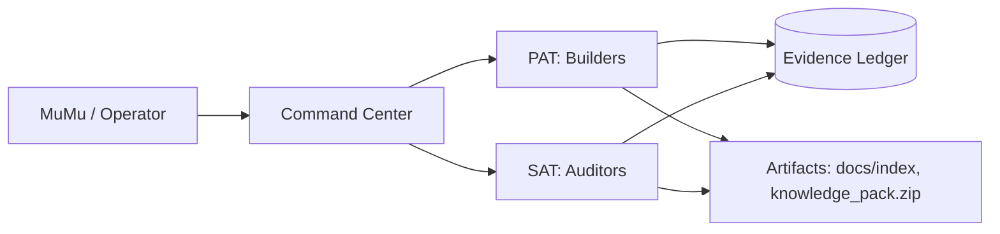

# BIZRA Ops Kit (v0.1)

A small, practical toolkit you can run **locally** to inventory your workspace, generate evidence receipts, and bootstrap a disciplined “Personal Autonomy Team” workflow (PAT/SAT style) without heavy tooling.

## What you get
- Fast **file inventory** scripts (PowerShell + Bash) → `manifest.jsonl`
- Optional **secrets scan** wrapper (uses `trufflehog` if installed)
- **Repo health** runner (best-effort multi-language checks)
- **Knowledge pack** generator (summaries + optional zip bundle)
- **Evidence ledger** templates + JSON schema for signed receipts

## Recommended structure (drop this into your main workspace)
```
/BIZRA
  /evidence
  /catalog
  /ops   <-- this kit
  /projects
  /data
```

## PAT/SAT model (simple + effective)
- **PAT (Personal Autonomy Team)**: executes work (inventory, packaging, analysis, refactors)
- **SAT (Safety & Assurance Team)**: validates (tests, security scans, policy gates, evidence checks)
- **Ledger**: stores receipts (what happened, why, proof, outputs)

### Mermaid view


## Quick start (Windows)
1) Open PowerShell in the folder that contains `ops/` (this kit).
2) Run:
```powershell
./scripts/inventory.ps1 -Root "C:\BIZRA" -OutDir "C:\BIZRA\catalog"
./scripts/repo_health.ps1 -Root "C:\BIZRA" -OutDir "C:\BIZRA\evidence"
python .\scripts\make_knowledge_pack.py --root "C:\BIZRA" --catalog "C:\BIZRA\catalog" --out "C:\BIZRA\catalog"
```

## Quick start (Linux/macOS)
```bash
chmod +x ./scripts/*.sh
./scripts/inventory.sh --root "$HOME/BIZRA" --out "$HOME/BIZRA/catalog"
./scripts/repo_health.sh --root "$HOME/BIZRA" --out "$HOME/BIZRA/evidence"
python3 ./scripts/make_knowledge_pack.py --root "$HOME/BIZRA" --catalog "$HOME/BIZRA/catalog" --out "$HOME/BIZRA/catalog"
```

## Outputs
- `catalog/manifest.jsonl` — line-delimited JSON records for files
- `catalog/catalog_summary.json` — counts, size buckets, top extensions, newest/oldest
- `catalog/knowledge_pack.zip` (optional) — curated bundle (README + summaries + selected files list)
- `evidence/receipts/*.json` — receipts (signed later if you wire signing)

## Notes
- Hashing **every** file in very large trees can be slow. By default, scripts avoid hashing big files.
- For maximum speed: run inventory on your **top-level folders** first, then drill down selectively.
