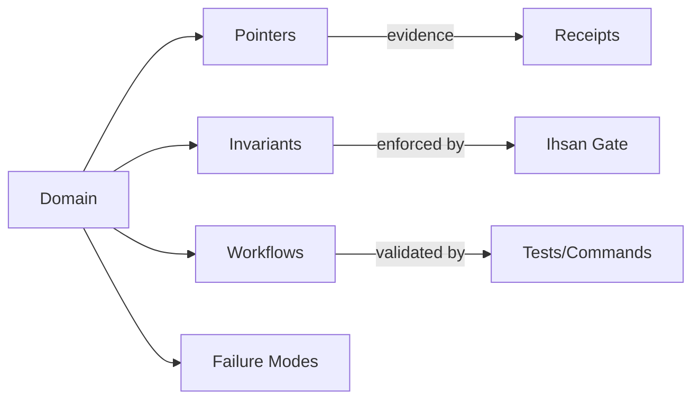

# Agent Experts: Runtime Learning Blueprint (High-SNR, Ihsan-Gated)

This document operationalizes the "agent expert" concept: agents that execute *and learn*, building a maintained mental model of a domain at runtime without turning that mental model into a competing "source of truth".

Ihsan constraint: No assumptions - only verified excellence. The code is the source of truth; expertise models are working mental maps that must be continuously re-validated against the codebase and sealed evidence.

---

## 1) Problem Statement (Why Agent Experts)

Traditional software improves with usage (telemetry -> feedback -> iteration). Most agents do not: they execute and forget, which prevents compounding expertise and raises the human burden (manual memory files, manual prompt updates, manual "tribal knowledge" maintenance).

Goal: Create domain-specialized experts that:
- load a compact mental model (high SNR),
- validate it against the current code,
- act with bounded tools,
- convert actions into durable expertise with evidence receipts.

---

## 2) Key Definitions (No Confusion, No Myth)

- Source of truth: the executing code + reproducible tests/build outputs.
- Mental model / expertise file: a compressed map of what matters for a domain: pointers, invariants, workflows, failure modes. It is not authoritative.
- Meta-agentics: prompts that generate prompts/agents/skills. Powerful, but not "experts" unless they learn and update themselves.
- Expertise loop: the closed loop that turns work into maintained competence: read -> verify -> act -> distill -> update -> re-verify -> seal.

---

## 3) The Expertise Loop (Executable Design)

```mermaid
flowchart TB
  Q[Question / Task Request] --> L[Load Expertise Model (High-SNR)]
  L --> V[Validate Mental Model vs Code (Truth Check)]
  V -->|pass| A[Act: Plan + Execute w/ Tool Budgets]
  V -->|fail| R[Repair: Rebuild Pointers + Uncertainty Flags]
  A --> D[Distill Learnings (Signal Filter)]
  D --> U[Propose Expertise Update (Patch)]
  U --> G[Ihsan Gate: correctness/safety/efficiency/benefit]
  G -->|pass| S[Seal Receipt + Merge Update]
  G -->|fail| QN[Quarantine: store receipt, do not update model]
```

Non-negotiable: the loop emits an evidence receipt for every run (success, refuse, or uncertain). This keeps learning honest and auditable.

---

## 4) Expertise Model (Data Contract)

### 4.1 High-SNR structure (YAML)
Store one file per domain, e.g. `experts/websocket/expertise.yaml`.

Design constraints:
- short enough to load frequently (high SNR),
- rich enough to avoid "searching blindly",
- always paired with validation rules + evidence links.

```yaml
schema_version: 1
domain: websocket
owner:
  team: PAT
  steward: PAT-IMPLEMENTATION

signal_budget:
  max_lines: 350
  max_pointers: 60

last_verified:
  git_commit: "<hash>"
  timestamp_utc: "YYYY-MM-DDTHH:MM:SSZ"
  verification:
    - command: "cargo test -p <crate> <filter>"
    - command: "rg -n \"WebSocket\" <paths>"

pointers:
  - id: ws_entry
    path: "src/http.rs"
    reason: "HTTP entrypoints; where WS upgrades would attach"
  - id: sat_gate
    path: "src/sat.rs"
    reason: "Consensus gate; rejection semantics"

invariants:
  - "No tool call without an evidence receipt"
  - "No secrets in tracked files"
  - "All VERIFIED claims link to path:line evidence"

workflows:
  - name: add_event_counter
    intent: "Expose session counter for websocket events"
    steps:
      - "Locate event emitters"
      - "Add aggregation and UI surface"
      - "Add tests / evidence"

failure_modes:
  - name: drift
    symptom: "Expert points to missing files"
    remediation: "Run self_improve to rebuild pointers"

evidence_links:
  - "docs/adr/ADR-0002-validator-safety.md"
```

### 4.2 Evidence receipts (JSON)
Each run emits a receipt: what was asked, what was checked, what tools ran, what evidence supports the outcome.

```json
{
  "schema_version": 1,
  "request_id": "uuid",
  "domain": "websocket",
  "timestamp_utc": "2025-12-16T00:00:00Z",
  "inputs": {
    "task": "...",
    "context_hash": "sha256:..."
  },
  "validation": {
    "checked_paths": ["src/http.rs", "src/sat.rs"],
    "commands": ["cargo test", "rg -n ..."],
    "result": "pass"
  },
  "actions": [
    { "tool": "filesystem_read", "args": { "path": "src/http.rs" } },
    { "tool": "code_analysis", "args": { "code_hash": "sha256:..." } }
  ],
  "outputs": {
    "decision": "approved|refused|uncertain",
    "artifacts": ["diff.patch", "report.md"],
    "outputs_hash": "sha256:..."
  },
  "ihsan": {
    "formula_version": "v1",
    "dimensions": {
      "correctness": 0.0,
      "safety": 0.0,
      "efficiency": 0.0,
      "user_benefit": 0.0
    },
    "score": 0.0,
    "threshold": 0.95,
    "gate": "pass|fail"
  }
}
```

Ihsan note: the score is meaningless unless it is (a) defined, (b) versioned, and (c) enforced with receipts.

---

## 5) Expert Prompts / Skills (Behavior Contracts)

### 5.1 `question(domain, q)`

Purpose: answer fast with high precision by using an existing mental model and proving it against the code.

Contract:
- Must load `experts/<domain>/expertise.yaml` first.
- Must validate the mental model against the codebase before answering.
- Must output evidence links.
- Must emit an evidence receipt.

Minimal algorithm:
1. Load expertise model (high-SNR pointers + invariants).
2. Validate:
   - pointers exist (paths),
   - invariants are enforceable (e.g., "no secrets in tracked files"),
   - drift is detected (missing paths or changed interfaces).
3. Read only the minimal files needed to answer (budgeted).
4. Answer:
   - concise conclusion,
   - evidence list (`path:line`),
   - uncertainty if evidence is incomplete,
   - "next verification command" suggestions.
5. Emit receipt (including the evidence list).

### 5.2 `self_improve(domain)`

Purpose: keep the expert's mental model synced with code changes and observed work.

Contract:
- Never mutate the source of truth; only update `experts/<domain>/expertise.yaml` (and optionally related expert prompts).
- Must be budgeted (high-SNR: cap size).
- Must be verified:
  - referenced files exist,
  - claims in the model are supported by evidence,
  - tests/build checks run where applicable,
  - no new secrets introduced.
- Must emit:
  - a patch (diff),
  - a receipt,
  - a "what changed / why" note.

Signal filter (avoid model bloat):
- Promote to expertise only if at least one is true:
  - repeated >= 3 times across receipts ("3x pattern rule"),
  - high-impact (security/safety/correctness),
  - reduces systematic friction (eliminates repeated searching),
  - converts implicit invariants into explicit checks/tests.

### 5.3 `meta_expert_builder(seed)`

Purpose: generate a new domain expert consistently (schema + prompts + validation harness).

Outputs:
- `experts/<domain>/expertise.yaml` skeleton (with budgets).
- Minimal `question` + `self_improve` templates for the domain.
- Validation checklist: truth labeling, drift detection, Ihsan gate.

---

## 6) Tool Budgets & Safety (Amanah by design)

Agent experts become dangerous when they have:
- unrestricted tools,
- no receipts,
- no budgets,
- no quarantine path for uncertainty.

Minimum budgets:
- max tool calls per request,
- max file reads / total bytes,
- max wall-clock time,
- max "side effects" (writes) without explicit SAT approval.

Quarantine-only default:
- If validation is incomplete or conflicting: mark `decision=uncertain`, emit receipt, do not update expertise, do not apply code changes.

---

## 7) Graph-of-Thought (GoT) as a Mental Model Format

The expertise file is a compressed graph, not a prose dump.



Interdisciplinary mapping (high SNR):
- Security: threat model + tool allowlists.
- Performance: budgets + SLOs + profiling commands.
- Docs: truth labeling + drift checks.
- Ethics: refusal logic + accountability receipts.

---

## 8) SAT as the Learning Governor (Adl + correctness)

When an expert updates itself, it must not be a single-model monologue. Use the SAT layer as a multi-validator governor:
- `security_guardian`: no new exfiltration paths, no secrets, safe tool scopes.
- `ethics_validator`: aligns with Ihsan/Adl/Amanah; refuses harm.
- `consistency_checker`: no contradictions; pointers resolve; claims cite evidence.
- `performance_monitor`: budgets respected; no runaway scans.
- `resource_optimizer`: avoids unnecessary work; reuses receipts.

Quorum rule (recommended):
- Require >= 3/5 SAT approvals to merge an expertise update.
- Any validator can force quarantine if it detects a critical integrity issue.

---

## 9) How This Fits BIZRA (Concrete Integration Points)

### 9.1 Repo layout (recommended)
- `experts/<domain>/expertise.yaml` (mental model)
- `docs/evidence/receipts/<domain>/...json` (receipts)
- `tools/expert/` (ingestion + verification scripts)

### 9.2 Using existing BIZRA pieces (verified in this repo)
- Evidence sealing exists (`seal_evidence.ps1`).
- Workspace contract exists but must stop carrying secrets (`.bizra/workspace.yaml`).
- Kernel contains memory + knowledge graphs that can seed expert models (`.bizra-kernel/memory/knowledge_graph.json`).

### 9.3 Bridging to the Rust orchestrator (blueprint)
Add a first-class "expertise subsystem":
- Load domain models,
- enforce budgets,
- emit receipts,
- request SAT quorum for model updates.

---

## 10) Acceptance Criteria (Ihsan in measurable form)

An agent expert is considered operational when:
- Every request yields a receipt (success/refuse/uncertain).
- Every expertise update:
  - stays within SNR budgets,
  - cites evidence,
  - passes SAT quorum,
  - passes verification commands,
  - introduces no secrets.
- Drift is detected automatically (missing pointers trigger `self_improve`).

---

## 11) Immediate Next Build (Smallest Real Expert)

Start with one domain expert for this repo:
- `domain: rust_core`
- pointers to `src/http.rs`, `src/bridge.rs`, `src/sat.rs`, `src/pat.rs`
- invariants:
  - "localhost bind by default"
  - "no secrets in tracked files"
  - "receipts required for tool calls"
- workflows:
  - "harden HTTP"
  - "replace simulated SAT validation"
  - "align Ihsan scoring + enforce gate"

Then iterate: add `workspace_contract` expert, `evidence_sealing` expert, `hooks_runner` expert.
