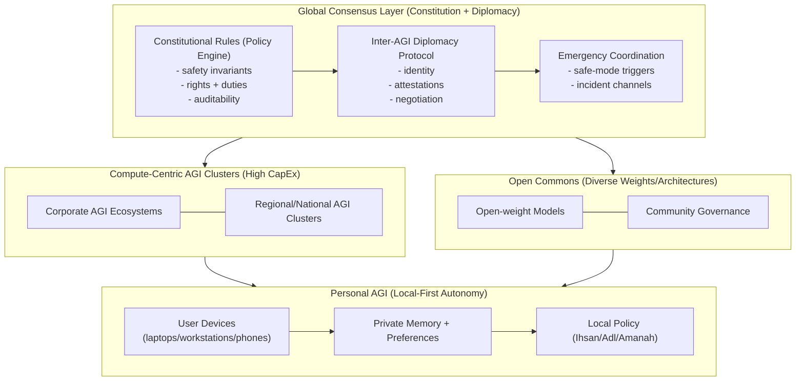
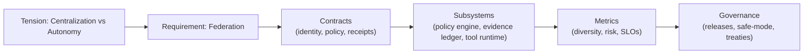

# Federated AGI Hybrid: Centralization Dilemma -> BIZRA Architecture Stance

This document translates the "centralization vs decentralization" dilemma into a **BIZRA-aligned, evidence-gated architectural stance**. It is written under Ihsan (excellence + benevolence) with Adl (justice) and Amanah (trust) as hard constraints.

**Boundary:** This is not a market prediction document. It is a systems blueprint for designing BIZRA to remain safe, resilient, and sovereign under multiple plausible futures.

---

## 1) Intent Gate (SAPE Module 1)

### Question
How should BIZRA architect for a world where **centralization pressures** are real (capital + compute + network effects), but **decentralization is ethically and safety-critical** (single-point-of-failure risk, autonomy, diversity)?

### Success Criteria (Ihsan)
- The architecture works if centralized AGI labs dominate, *and* if open/distributed models proliferate.
- The system can explain and evidence its safety decisions (receipts) and quarantine uncertainty.
- Claims labeled "VERIFIED" always link to evidence; everything else is labeled as assumption or projection.

---

## 2) Claims: Evidence Labeling (Ihsan = no unearned certainty)

The transcript includes empirical-sounding claims (e.g., training cost magnitudes, chip market share). In this repo we do **not** have evidence for those numbers, so they are treated as **assumptions** until cited.

### Assumptions (UNVERIFIED in this repo)
- "Next-gen training costs ~ $100B+"
- "NVIDIA ~90% market share"
- "OpenAI 100M+ weekly active users"
- "Only 3-5 entities can afford frontier training"

### Design-relevant patterns (plausible, but still label as projection)
- Strong network effects tend to centralize platforms.
- Safety/regulatory regimes often prefer central control points.
- Open weight releases can create "decentralization shocks."

**Action:** If you want these in "VERIFIED", add citations to an evidence pack (report PDFs, datasets, links) and seal them.

---

## 3) Federated Hybrid Reference Architecture (Blueprint)

The winning stance for BIZRA is a **federated hybrid**:
- Centralized capabilities exist (frontier training, global coordination).
- Distributed autonomy exists (local inference, personalization, private memory, local policy).
- A governance layer coordinates interaction without creating a single god-mode controller.

**BIZRA stance:** Build the Personal AGI layer as primary, with optional federation to clusters and open commons under explicit policy and receipts.

---

## 4) BIZRA-Specific Mapping (From Blueprint to Repo Reality)

### 4.1 What BIZRA already has (in this repo)
- A dual-agentic scaffold (PAT/SAT orchestration) (`src/lib.rs:20`, `src/bridge.rs:27`).
- Quorum logic conceptually present for SAT (3/5) (`src/sat.rs:70`), and an ADR describing validator safety parameters (`docs/adr/ADR-0002-validator-safety.md:1`).
- Workspace contract mechanism (but currently split-brain + secrets risk) (`.bizra/workspace.yaml:5`).
- Evidence sealing tooling exists (`seal_evidence.ps1:1`).

### 4.2 What must change to support federation
Federation requires **trust-minimized coordination**, not "trust me" centralization.

Minimum architectural additions:
- **Identity:** node identity keys and stable node IDs for interop (local + federation).
- **Receipts:** evidence ledger receipts for policy decisions and tool calls (append-only + seal).
- **Policy engine:** explicit allow/deny/uncertain gates (Ihsan).
- **Quarantine path:** safe handling for uncertainty (no side effects).
- **Interop protocol:** A2A/MCP adapters that are real and allowlisted (today are stubbed).

---

## 5) Ethics as Systems Engineering (Ihsan/Adl/Amanah)

### Ihsan (excellence + benevolence)
- Enforce a versioned scoring formula and threshold as a **gate**, not a label.
- Require receipts for decisions; "unverified" outcomes go to quarantine.

### Adl (justice)
- Consistency across similar requests: refusal/approval should be measurable.
- Audit metrics: refusal rates by category; false-positive/false-negative tracking.

### Amanah (trust)
- Secrets never stored in tracked config; least privilege for tools; signed evidence.
- Data minimization: store only what is needed; prefer local processing.

---

## 6) Technical Strategy: Survive Both Futures

### 6.1 If centralization dominates (Phase 1 world)
BIZRA should:
- remain **model-provider agnostic** (pluggable inference backends),
- keep user memory/policies local,
- treat corporate AGI as an external service behind strict tool/policy boundaries,
- preserve autonomy via receipts + local governance.

### 6.2 If decentralization accelerates (open-weight shock)
BIZRA should:
- support multiple model "species" (diversity index),
- run local ensembles/quorums for critical decisions,
- allow community-governed policy bundles, signed and versioned.

---

## 7) Graph-of-Thought Systems: From Ideas -> Implementable Contracts

This is how to keep the system "high SNR": every abstraction must compile down to a contract, a subsystem, and a measurable metric.

---

## 8) Implementation Roadmap Addendum (What to build next)

**Near-term (aligns with Phase 0-2 in `docs/blueprints/backlog_v1.yaml`)**
- Remove secrets and harden defaults (Amanah).
- Implement receipts and quarantine (Ihsan).
- Make SAT validators real (Adl + safety).

**Mid-term (federation readiness)**
- Node identity + attestation format.
- Interop protocol spec (A2A/MCP real adapters with allowlists).
- "Emergency safe-mode" protocol shared across nodes/clusters.

**Long-term (federated governance)**
- Constitutional bundles: signed policy packages.
- Cross-AGI diplomacy protocol: negotiation + dispute resolution with receipts.
- Diversity strategy: multi-model quorum for high-impact decisions.

