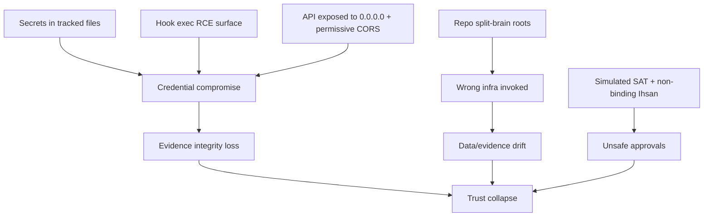

# BIZRA Roadmap + Execution Backlog (High-SNR, Evidence-Gated)

This is the "next step" artifact after the audit and master blueprint: a prioritized, dependency-aware backlog that is actionable by humans and agents, with explicit evidence hooks and Ihsan/Adl/Amanah gates.

Primary references:
- `docs/blueprints/MASTER_BLUEPRINT.md`
- `docs/blueprints/UNIFIED_ACTION_FRAMEWORK.md`
- `docs/blueprints/AGENT_EXPERTS_RUNTIME_LEARNING.md`
- Machine-readable backlog: `docs/blueprints/backlog_v1.yaml`

## Current status (MEASURED)
- Evidence-first activation loop exists: `tools/run_master.ps1` and `tools/activate_team.ps1` write receipts under `docs/evidence/receipts/` and index into the Data Lake.
- Phase 0 hardening is partially complete in this repo: HTTP is localhost-bound + token-gated + restrictive CORS (`src/http.rs`), hook execution is allowlisted (`.bizra-kernel/kernel-entry.ts`), and evidence tooling blocks `Invoke-Expression` (`tools/phase0_audit.ps1`).
- Knowledge refinery outputs exist (manifest + ledger chain) and are anchored to Genesis: `BIZRA_KNOWLEDGE_MANIFEST.json`.
- Next high-leverage work: replace simulated SAT validations with real checks and negative tests (`src/sat.rs`), then formalize evidence ledger + policy engine.

---

## 1) Cascading Risk Map (Stop the bleed first)

Backlog ordering follows this map: reduce blast radius first, then make gates real, then scale.

---

## 2) Delivery Model (PMBOK + DevOps)

### Governance cadence
- Weekly: risk review + SLO review + evidence sealing checkpoint.
- Per-PR: CI gates + receipts + security scanning.
- Per-release: progressive rollout gates + post-release evidence pack.

### Definition of Done (global)
- Security: no secrets in repo; tool scopes enforced; receipts for actions.
- Quality: tests exist for critical invariants; negative tests for rare paths.
- Performance: budgets are encoded (timeouts, max tool calls); SLOs measured.
- Docs: truth-labeled; "VERIFIED" always has evidence link.
- Ethics: Ihsan scoring definition is versioned and enforced; quarantine path exists.

---

## 3) Prioritized Roadmap (Phases)

### Phase 0 (P0): Hardening + Truth Alignment (0-7 days)
Outcome: reduce immediate compromise risk; stop misleading "production" claims; create reliable contracts.

- Ignite Citadel (Docker) and prove deterministic readiness/acceptance gates; mint a replayable Genesis Receipt (`docker-compose.yml:1`, `scripts/ignite_node0.ps1:1`, `scripts/verify_node0.ps1:1`, `scripts/genesis_receipt.py:1`, `schemas/genesis_receipt_v1.schema.json:1`).
- Baseline requirements, traceability, RACI, and SLOs (truth-labeled; evidence-gated).
- Remove secrets from tracked files; add `.env.example`; add secret scan gate.
- Restrict API surface (localhost bind by default; CORS tighten; minimal auth).
- Lock down hook execution (allowlist + safe runner; quarantine by default).
- Replace `Invoke-Expression` in evidence capture with safe invocation.
- Align Ihsan scoring definition (single formula + version); enforce at least at "receipt" level.
- Resolve workspace contract drift (single canonical root resolution; no hardcoded external roots by default).

### Phase 1 (P1): Make SAT Real (1-3 weeks)
Outcome: approvals become meaningful and testable.

- Implement SAT validators as real checks (security/ethics/consistency/perf/resource).
- Add negative tests: force SAT rejection paths; verify Bridge halts safely.
- Introduce "quarantine" decision state and receipts.

### Phase 2 (P1): Evidence Ledger + Tool Runtime (3-6 weeks)
Outcome: actions are auditable; tool calls are bounded and safe.

- Implement a receipt schema + storage location; seal receipts in evidence pack.
- Define federation primitives: node identity + signed attestations + safe-mode protocol.
- Replace stubbed MCP/A2A with real adapters behind allowlists and timeouts.
- Add policy engine as symbolic harness for allow/deny/uncertain.
- Ignite the Brain: ingest the knowledge ledger into Neo4j and standardize retrieval queries (see `EPIC-PH2-KNOW` in `docs/blueprints/backlog_v1.yaml`).
- Activate the Nervous System: expose the graph via the Sovereign Kernel API (token-gated, FATE-enforced, metrics + receipts) (`docs/operations/sovereign_kernel_runbook.md`).

### Phase 3 (P2): Performance + Observability (6-10 weeks)
Outcome: budgets and SLOs are measurable; regressions are caught automatically.

- Implement real PAT concurrency (bounded spawning + deadlines + backpressure).
- Metrics + tracing + SLO endpoints and dashboards.
- Load tests + profiling harness.
- Expand operational maturity: incident management, DR/backup/restore drills, LTS/deprecation, privacy/retention, cost controls, accessibility, and retirement policy.

### Phase 4 (P2): Agent Experts (10-16 weeks)
Outcome: the system compounds expertise safely, without global forced memory.

- Create first domain expert (`rust_core`) with expertise.yaml + self_improve loop.
- Integrate chat-history ingestion into expert seeding (quarantine-first; high-SNR filter).
- Add SAT quorum for expertise updates; seal expertise changes with receipts.
- Add federated governance specs: constitutional policy bundles + diplomacy protocol (spec-first).

---

## 4) CI/CD Gate Matrix (Minimum)

| Gate | Trigger | Must pass | Evidence artifact |
|---|---|---|---|
| `fmt/lint` | PR | rustfmt, clippy (warnings policy), JS lint (if any) | build logs |
| `tests` | PR | unit + negative tests for safety gates | test report |
| `deps` | PR | `npm audit` + Rust advisory scan | audit report |
| `secrets` | PR | secret scan (denylist patterns + entropy) | scan report |
| `evidence` | PR/release | receipt schema validates + sealing runs | sealed tag + hashes |

---

## 5) Backlog Source of Truth

The canonical backlog is stored in: `docs/blueprints/backlog_v1.yaml`

It is machine-readable to support "symbolic harness" automation (agents can plan/execute/verify against it without inventing tasks).
