# BIZRA Sovereign Provenance Graph v2.0

Seven structural improvements are encoded in this canonical graph.

```mermaid
graph TD
    %% ═══════════════════════════════════════════
    %% LAYER 0 — AXIOMATIC ROOT (no incoming edges)
    %% ═══════════════════════════════════════════
    A0["🔒 GENESIS AXIOM
    ─────────────────────
    الرسالة · SHA256: e05b73b9...
    البذرة   · SHA256: f95bc6f7...
    Ramadan 2023 · Pre-Code Origin
    ─────────────────────
    BLAKE3 Chain Anchor: Ω"]

    %% ═══════════════════════════════════════════
    %% LAYER 1 — DUAL BRANCH (normative + causal)
    %% ═══════════════════════════════════════════
    B1["📜 NORMATIVE BRANCH
    Constitution / Covenant
    H0 · H1 · H2 Invariants
    Policy Hash: SHA256(Constitution)"]

    B2["🌱 CAUSAL BRANCH
    Spiritual → Technical Mapping
    الظن → لا ظن
    ح-س-ن → ihsan_gate ≥ 0.95
    الربا → Proof-of-Impact"]

    %% ═══════════════════════════════════════════
    %% LAYER 2 — BRIDGE (only document connecting both branches)
    %% ═══════════════════════════════════════════
    C1["🔑 ihsan_as_architecture.md
    ─────────────────────
    Theorem Ω.0: الظن → ح-س-ن → ihsan_gate
    REQUIRED for final gate
    Cross-linked: Constitution + Atlas + Proofs"]

    %% ═══════════════════════════════════════════
    %% LAYER 3 — STANDARDS CONVERGENCE
    %% ═══════════════════════════════════════════
    D1["🛡️ SPS / Security Standard
    AEGIS-Λ Zero-Trust
    FATE Gate · Guardian
    OPA Policy Engine"]

    D2["🗺️ Architecture Atlas v4.0
    28 Mermaid Diagrams
    56 Agents · PAT/SAT Topology
    Capability Matrix YAML"]

    D3["📊 PoI / Attestation Model
    77K attestations/sec
    Gini ≤ 0.35 invariant
    KL-Divergence Bias Check"]

    %% ═══════════════════════════════════════════
    %% LAYER 4 — IHSĀN QUALITY GATE
    %% ═══════════════════════════════════════════
    E1{"⚖️ IHSĀN GATE
    SNR ≥ 0.90
    ihsan_score ≥ 0.95
    Z3 SMT: SAT?
    ─────────────
    PASS → continue
    FAIL → quarantine"}

    %% ═══════════════════════════════════════════
    %% LAYER 5 — CI/CD FORTRESS
    %% ═══════════════════════════════════════════
    F1["⚙️ CI/CD PIPELINE
    9-Probe Defense Matrix
    Cross-Pollination Rule
    BLAKE3 artifact hashing"]

    %% ═══════════════════════════════════════════
    %% LAYER 6 — FIVE PARALLEL ARTIFACT STREAMS
    %% ═══════════════════════════════════════════
    G1["📦 Signed Manifests
    EvidenceManifestEntry
    logical_path · source_root
    blake3 · sha256 · visibility"]

    G2["🧾 SBOM
    CycloneDX + SPDX
    Dependency graph
    License compliance"]

    G3["🔏 in-toto + SLSA L3
    Supply chain provenance
    Builder identity
    Two-party review record"]

    G4["🧪 Run Evidence
    8172+ test receipts
    Latency: <1μs finality
    PoI overhead: 0.46%
    Throughput: 77K/sec"]

    G5["🤝 Known-Me Gate
    knows_me_score ≥ 8.5
    Lyapunov stability proof
    User Zero = Founder
    PAT partnership verified"]

    %% ═══════════════════════════════════════════
    %% LAYER 7 — MERKLE CONSTRUCTION
    %% ═══════════════════════════════════════════
    H1["🌳 MERKLE ROOT
    BLAKE3(G1‖G2‖G3‖G4‖G5)
    Deterministic ordering
    Tamper-evident chain"]

    %% ═══════════════════════════════════════════
    %% LAYER 8 — TEMPORAL LOCK (dual anchoring)
    %% ═══════════════════════════════════════════
    I1["⏱️ RFC3161 Timestamp
    DigiCert TSA
    Legally recognized
    X.509 signed token"]

    I2["⛓️ OpenTimestamps
    Bitcoin blockchain anchor
    Decentralized · Immutable
    OTS proof file"]

    %% ═══════════════════════════════════════════
    %% LAYER 9 — FINAL SEAL
    %% ═══════════════════════════════════════════
    J1["🔐 CHAIN_ANCHOR.json
    ─────────────────────
    genesis_blake3: Ω
    merkle_root: H1
    rfc3161_token: I1
    ots_proof: I2
    policy_hash: SHA256(Constitution)
    ─────────────────────
    Ed25519 Signature
    signer_pubkey: [public key]"]

    %% ═══════════════════════════════════════════
    %% LAYER 10 — DUAL-TIER OUTPUT
    %% ═══════════════════════════════════════════
    K1["🔒 private_full/
    Raw founding PDFs
    Full run evidence
    Internal transcripts
    Complete metrics"]

    K2["🌐 public_redacted/
    Hash metadata only
    Provenance notes
    Filtered corpus index
    Public constitution"]

    %% ═══════════════════════════════════════════
    %% VERIFICATION FEEDBACK LOOP
    %% ═══════════════════════════════════════════
    L1{"🔄 verify_evidence_package.py
    Hash chain valid?
    Signature intact?
    Gate fields present?
    ─────────────
    PASS → release
    FAIL → back to F1"}

    %% ═══════════════════════════════════════════
    %% NODE0 EMULATION (parallel track)
    %% ═══════════════════════════════════════════
    M1["🖥️ Node0 Lifecycle
    Emulation Run
    Full PAT/SAT activation
    929KB binary sovereign"]

    %% ═══════════════════════════════════════════
    %% EDGE DEFINITIONS
    %% ═══════════════════════════════════════════

    %% Root → Dual Branch
    A0 -->|"covenant"| B1
    A0 -->|"causal origin"| B2

    %% Branches → Bridge document
    B1 -->|"normative constraints"| C1
    B2 -->|"theological mapping"| C1

    %% Branches → Standards
    B1 -->|"policy hash"| D1
    C1 -->|"ihsan definition"| D2
    C1 -->|"PoI theology"| D3

    %% Standards → Ihsān Gate
    D1 -->|"security constraints"| E1
    D2 -->|"architectural spec"| E1
    D3 -->|"attestation model"| E1

    %% Ihsān Gate → CI/CD (or quarantine)
    E1 -->|"✅ PASS"| F1
    E1 -->|"❌ FAIL"| QZ["🚫 QUARANTINE\nartifact rejected\nalert raised"]

    %% CI/CD → Five Parallel Streams
    F1 --> G1
    F1 --> G2
    F1 --> G3
    F1 --> M1

    %% Node0 Emulation → Evidence streams
    M1 --> G4
    M1 --> G5

    %% Five Streams → Merkle Root
    G1 -->|"blake3"| H1
    G2 -->|"blake3"| H1
    G3 -->|"blake3"| H1
    G4 -->|"blake3"| H1
    G5 -->|"blake3"| H1

    %% Merkle → Temporal Lock (dual)
    H1 --> I1
    H1 --> I2

    %% Temporal Lock → Final Seal
    I1 -->|"rfc3161_token"| J1
    I2 -->|"ots_proof"| J1
    H1 -->|"merkle_root"| J1
    A0 -->|"genesis_blake3: Ω"| J1

    %% Final Seal → Dual Output
    J1 --> K1
    J1 --> K2

    %% Verification Feedback Loop
    K1 --> L1
    K2 --> L1
    L1 -->|"❌ tamper detected"| F1
    L1 -->|"✅ verified"| REL["🚀 RELEASE\nBIZRA-EVIDENCE-PACKAGE\nv1.0-GENESIS\n.tar.gz · .blake3 · .sig"]

    %% PoI feeds back into Merkle (orphan fix)
    D3 -->|"attestation schema"| G1

    %% Style definitions
    classDef axiom fill:#1a0a00,stroke:#ff8c00,color:#ff8c00,font-weight:bold
    classDef branch fill:#0a1a0a,stroke:#00ff88,color:#00ff88
    classDef bridge fill:#1a0a1a,stroke:#ff00ff,color:#ff00ff,font-weight:bold
    classDef gate fill:#1a1a0a,stroke:#ffff00,color:#ffff00
    classDef artifact fill:#0a0a1a,stroke:#0088ff,color:#88bbff
    classDef merkle fill:#0a1a1a,stroke:#00ffff,color:#00ffff,font-weight:bold
    classDef temporal fill:#1a0a0a,stroke:#ff4444,color:#ff8888
    classDef seal fill:#0a0a0a,stroke:#ffffff,color:#ffffff,font-weight:bold
    classDef output fill:#001a0a,stroke:#00aa44,color:#00ff88
    classDef release fill:#1a1a00,stroke:#aaaa00,color:#ffff44,font-weight:bold
    classDef danger fill:#1a0000,stroke:#ff0000,color:#ff4444

    class A0 axiom
    class B1,B2 branch
    class C1 bridge
    class D1,D2,D3 artifact
    class E1,L1 gate
    class F1,M1 artifact
    class G1,G2,G3,G4,G5 artifact
    class H1 merkle
    class I1,I2 temporal
    class J1 seal
    class K1,K2 output
    class REL release
    class QZ danger
```

## Seven Structural Improvements
1. Dead-end `SPS` resolved into machine-enforced gate flow.
2. Orphaned PoI node now feeds gate constraints and manifest schema.
3. Ihsān gate explicit and fail-closed.
4. `ihsan_as_architecture.md` explicit bridge with dual lineage.
5. Dual temporal anchoring (RFC3161 + OpenTimestamps).
6. Verification feedback loop closes the system.
7. Node0 emulation stream feeds the same Merkle root as supply-chain artifacts.
