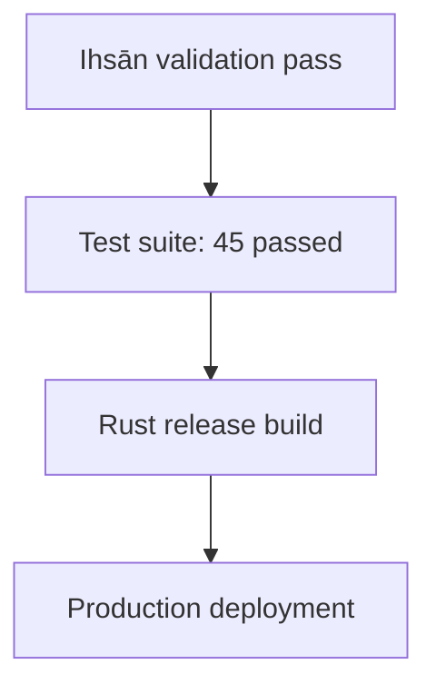

# Evidence Chain Tracker Skill

## Purpose

This skill enables Claude to automatically track evidence chains across BIZRA operations, validate evidence lineage, detect broken trails, and reconstruct audit paths. It ensures the receipt-native architecture maintains complete, verifiable evidence graphs.

## When to Use

Claude should invoke this skill when:
- Validating audit trail completeness
- Investigating evidence gaps or breaks
- Reconstructing operation sequences
- Verifying evidence dependencies
- Generating compliance reports
- Detecting orphaned receipts
- Analyzing evidence graph topology

## Evidence Chain Concepts

### Chain Types

1. **Linear Chain**: Sequential operations (A → B → C)
2. **Tree Chain**: Branching operations (A → B, A → C)
3. **DAG Chain**: Complex dependencies (multi-parent operations)
4. **Circular Chain**: ⚠️ INVALID - indicates logic error

### Chain Metadata

Each receipt can reference prior evidence:
```json
{
  "receipt_id": "build-20260120-103000",
  "timestamp": "2026-01-20T10:30:00Z",
  "task_summary": "Rust build after test pass",
  "evidence_chain": {
    "parent_receipts": ["test-20260120-102500"],
    "chain_depth": 2,
    "root_receipt": "validation-20260120-102000"
  },
  "rejection_codes": [],
  "escalation_level": "None",
  "integrity_hash": "abc123..."
}
```

## Capabilities

### 1. Chain Validation

Validate evidence chains for completeness:
```bash
# Scan all receipts
find docs/evidence/receipts -name "*.json" -type f

# Build dependency graph
python3 << 'EOF'
import json
import glob

receipts = {}
for path in glob.glob("docs/evidence/receipts/*.json"):
    with open(path) as f:
        r = json.load(f)
        receipts[r['receipt_id']] = r

# Validate all parent_receipts exist
broken_chains = []
for rid, receipt in receipts.items():
    parents = receipt.get('evidence_chain', {}).get('parent_receipts', [])
    for parent in parents:
        if parent not in receipts:
            broken_chains.append((rid, parent))

if broken_chains:
    print(f"❌ BROKEN CHAINS: {len(broken_chains)}")
    for child, missing in broken_chains:
        print(f"  {child} → {missing} (MISSING)")
    exit(2)  # Fail-closed
else:
    print("✅ All evidence chains valid")
EOF
```

### 2. Lineage Reconstruction

Reconstruct full lineage for a receipt:
```python
def get_lineage(receipt_id, receipts, visited=None):
    """Recursively build lineage tree"""
    if visited is None:
        visited = set()

    if receipt_id in visited:
        return {"error": "CIRCULAR_DEPENDENCY"}

    visited.add(receipt_id)
    receipt = receipts.get(receipt_id)

    if not receipt:
        return {"error": "MISSING_RECEIPT"}

    parents = receipt.get('evidence_chain', {}).get('parent_receipts', [])
    lineage = {
        "receipt_id": receipt_id,
        "timestamp": receipt['timestamp'],
        "task_summary": receipt['task_summary'],
        "parents": [get_lineage(p, receipts, visited.copy()) for p in parents]
    }

    return lineage
```

**Output Example**:
```json
{
  "receipt_id": "deploy-20260120-110000",
  "timestamp": "2026-01-20T11:00:00Z",
  "task_summary": "Production deployment",
  "parents": [
    {
      "receipt_id": "build-20260120-103000",
      "timestamp": "2026-01-20T10:30:00Z",
      "task_summary": "Rust build",
      "parents": [
        {
          "receipt_id": "test-20260120-102500",
          "timestamp": "2026-01-20T10:25:00Z",
          "task_summary": "Test suite pass",
          "parents": []
        }
      ]
    }
  ]
}
```

### 3. Orphan Detection

Find receipts with no children (potential incomplete workflows):
```python
def find_orphans(receipts):
    """Identify receipts that are never referenced"""
    all_ids = set(receipts.keys())
    referenced = set()

    for receipt in receipts.values():
        parents = receipt.get('evidence_chain', {}).get('parent_receipts', [])
        referenced.update(parents)

    orphans = all_ids - referenced

    # Filter out recent receipts (< 1 hour old) - may still be in-progress
    import datetime
    now = datetime.datetime.now(datetime.timezone.utc)
    true_orphans = []

    for oid in orphans:
        ts = datetime.datetime.fromisoformat(receipts[oid]['timestamp'])
        age_hours = (now - ts).total_seconds() / 3600
        if age_hours > 1:
            true_orphans.append(oid)

    return true_orphans
```

### 4. Chain Depth Analysis

Analyze evidence chain depths:
```
Chain Depth Analysis:
=====================
Depth 0 (roots): 12 receipts
  - validation-*: 5
  - ci-gate-*: 4
  - manual-init-*: 3

Depth 1: 25 receipts
  - build-*: 10
  - test-*: 8
  - lint-*: 7

Depth 2: 18 receipts
  - deploy-*: 6
  - evidence-*: 12

Depth 3: 5 receipts
  - post-deploy-*: 5

Max Depth: 3 ✓ (within limit of 10)
Average Depth: 1.5
```

### 5. Evidence Graph Visualization

Generate Mermaid/Graphviz graph:
```python
def generate_mermaid_graph(receipts, max_nodes=50):
    """Generate Mermaid flowchart for evidence chains"""
    lines = ["graph TD"]

    for rid, receipt in list(receipts.items())[:max_nodes]:
        # Sanitize ID for Mermaid
        safe_id = rid.replace("-", "_")
        label = f"{receipt['task_summary'][:30]}..."
        lines.append(f'  {safe_id}["{label}"]')

        parents = receipt.get('evidence_chain', {}).get('parent_receipts', [])
        for parent in parents:
            safe_parent = parent.replace("-", "_")
            lines.append(f'  {safe_parent} --> {safe_id}')

    return "\n".join(lines)
```

**Output**:


### 6. Temporal Consistency Check

Verify timestamps are monotonic in chains:
```python
def check_temporal_consistency(receipt_id, receipts):
    """Ensure parent timestamps < child timestamps"""
    receipt = receipts[receipt_id]
    child_ts = datetime.datetime.fromisoformat(receipt['timestamp'])

    violations = []
    parents = receipt.get('evidence_chain', {}).get('parent_receipts', [])

    for parent_id in parents:
        parent = receipts.get(parent_id)
        if not parent:
            continue

        parent_ts = datetime.datetime.fromisoformat(parent['timestamp'])

        if parent_ts >= child_ts:
            violations.append({
                "child": receipt_id,
                "child_ts": str(child_ts),
                "parent": parent_id,
                "parent_ts": str(parent_ts),
                "violation": "PARENT_AFTER_CHILD"
            })

    return violations
```

## Redis Integration

### Chain Cache

Store computed lineages in Redis for fast lookup:
```bash
# Store lineage
redis-cli -u $SYNAPSE_URL SET "bizra:chain:${receipt_id}" "${lineage_json}"

# Set TTL (1 hour)
redis-cli -u $SYNAPSE_URL EXPIRE "bizra:chain:${receipt_id}" 3600

# Retrieve cached lineage
redis-cli -u $SYNAPSE_URL GET "bizra:chain:${receipt_id}"
```

### Chain Metrics

Track chain statistics:
```
Key: bizra:chain:metrics
Value: {
  "total_receipts": 150,
  "total_chains": 45,
  "max_depth": 3,
  "avg_depth": 1.5,
  "orphan_count": 2,
  "broken_count": 0,
  "last_updated": "2026-01-20T11:00:00Z"
}
TTL: 300 seconds (5 minutes)
```

## Neo4j Graph Storage

For persistent evidence graphs:

### Create Receipt Node

```cypher
CREATE (r:Receipt {
  receipt_id: 'build-20260120-103000',
  timestamp: timestamp(),
  task_summary: 'Rust release build',
  integrity_hash: 'abc123...'
})
```

### Create Chain Relationships

```cypher
MATCH (parent:Receipt {receipt_id: 'test-20260120-102500'})
MATCH (child:Receipt {receipt_id: 'build-20260120-103000'})
CREATE (parent)-[:EVIDENCE_FOR]->(child)
```

### Query Full Lineage

```cypher
MATCH path = (root:Receipt)-[:EVIDENCE_FOR*]->(leaf:Receipt)
WHERE leaf.receipt_id = 'deploy-20260120-110000'
RETURN path
ORDER BY length(path) DESC
LIMIT 1
```

### Find Broken Chains

```cypher
MATCH (child:Receipt)
WHERE EXISTS {
  MATCH (child)
  WHERE child.evidence_chain IS NOT NULL
  AND NOT EXISTS {
    MATCH (parent:Receipt)-[:EVIDENCE_FOR]->(child)
  }
}
RETURN child.receipt_id, child.timestamp
```

## BIZRA Integration

### Receipt-First Development

Every receipt should reference its evidence dependencies:
```json
{
  "receipt_id": "new-operation-timestamp",
  "evidence_chain": {
    "parent_receipts": ["prerequisite-receipt-1", "prerequisite-receipt-2"],
    "chain_depth": 2,
    "root_receipt": "origin-receipt"
  }
}
```

### Fail-Closed Enforcement

**BLOCK if**:
- Parent receipt missing (broken chain)
- Circular dependency detected
- Temporal inconsistency (parent after child)
- Chain depth exceeds limit (10 levels)

**WARN but allow**:
- Orphaned receipts (no children after 1 hour)
- Multiple root receipts (parallel workflows)
- High chain depth (5-10 levels, investigate)

### Evidence-Driven Workflow

Chain tracking enables:
1. **Audit Trail Reconstruction**: From any receipt, trace back to root
2. **Compliance Demonstration**: Show complete evidence lineage
3. **Failure Analysis**: Identify which step in chain broke
4. **Optimization**: Detect redundant or inefficient chains

## Analysis Report Template

```markdown
## Evidence Chain Analysis Report

**Timestamp**: 2026-01-20T11:30:00Z
**Total Receipts**: 150
**Total Chains**: 45

### Chain Health

| Metric | Value | Status |
|--------|-------|--------|
| Broken Chains | 0 | ✅ PASS |
| Circular Dependencies | 0 | ✅ PASS |
| Temporal Violations | 0 | ✅ PASS |
| Orphaned Receipts | 2 | ⚠️ WARN |
| Max Chain Depth | 3 | ✅ PASS |
| Avg Chain Depth | 1.5 | ✅ PASS |

### Chain Statistics

**Root Receipts** (no parents):
- validation-*: 12
- ci-gate-*: 8
- manual-init-*: 5

**Leaf Receipts** (no children, recent):
- deploy-20260120-110000
- evidence-20260120-105500

**Deepest Chain**:
```
manual-init-20260120-100000
  → validation-20260120-102000
    → test-20260120-102500
      → build-20260120-103000
        → deploy-20260120-110000
(Depth: 5)
```

### Recommendations

1. ✅ All chains valid - no broken references
2. ⚠️ 2 orphaned receipts detected (> 1 hour old):
   - evidence-20260120-083000 (orphaned for 3h)
   - test-20260120-090000 (orphaned for 2h)
3. ✓ Temporal consistency maintained
4. ✓ No circular dependencies
5. 💡 Consider linking orphaned receipts or archiving if obsolete
```

## Tools Required

- **Read**: Access receipt files
- **Bash**: Execute Python scripts, JSON parsing, Redis queries, Neo4j cypher
- **Grep**: Search for receipt patterns
- **Write**: Save analysis reports, cache lineages

## Performance

- Chain validation: <500ms (150 receipts)
- Lineage reconstruction: <100ms (depth 5)
- Graph generation: <1s (Mermaid output)
- Redis cache lookup: <10ms
- Neo4j graph query: <200ms

## Quality Checks

Before reporting analysis:
- [ ] All receipts scanned
- [ ] Broken chains identified
- [ ] Orphans detected (exclude recent)
- [ ] Temporal consistency checked
- [ ] Circular dependencies ruled out
- [ ] Chain depths calculated
- [ ] Recommendations provided

---

**Skill Philosophy**: "Evidence chains tell the story of execution. Ensure every story is complete, consistent, and verifiable."

## Usage Pattern

```
User: "Validate evidence chains before deployment"

Claude:
1. Invokes: Evidence Chain Tracker Skill
2. Scans: docs/evidence/receipts/*.json
3. Analyzes: 150 receipts, 45 chains
4. Detects: 0 broken chains, 2 orphans (warn)
5. Reports: "✅ Evidence chains valid. 2 orphaned receipts detected (non-critical)"
6. Recommends: Review orphaned receipts: evidence-20260120-083000, test-20260120-090000
```

**This happens automatically** - users get immediate chain validation with actionable insights.

## Example: Investigating Deployment Failure

When a deployment fails, reconstruct the evidence chain:

```python
# Find failed deployment receipt
failed_deploy = "deploy-20260120-120000"

# Get lineage
lineage = get_lineage(failed_deploy, receipts)

# Output:
{
  "receipt_id": "deploy-20260120-120000",
  "task_summary": "Production deployment FAILED",
  "rejection_codes": ["IHSAN_GATE_FAIL"],
  "parents": [
    {
      "receipt_id": "build-20260120-115000",
      "task_summary": "Rust build",
      "parents": [
        {
          "receipt_id": "test-20260120-114500",
          "task_summary": "Test suite: 44/45 passed (1 FAIL)",
          "rejection_codes": [],
          "parents": []
        }
      ]
    }
  ]
}

# Analysis: Test failure (44/45) allowed to proceed → Build succeeded
# → Deployment blocked by Ihsān gate
# Root cause: Failed test should have escalated to High, blocked build
```

## Integration with Other Skills

**Works with**:
- **Receipt Generator**: Adds evidence_chain metadata when generating receipts
- **SAPE Analyzer**: Validates SAPE probe results are linked to execution receipts
- **Ihsān Validator**: Ensures constitution validation receipts in chain

**Triggers**:
- Before deployment: Validate entire chain from root to current
- After CI/CD: Ensure all gates produced linked receipts
- On failure: Reconstruct chain to identify root cause
